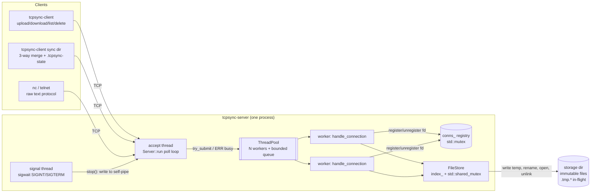

# Architecture

tcp-sync is a multithreaded TCP file synchronization service in C++17. It uses only POSIX sockets, `std::thread`, STL containers and synchronization primitives, with no third-party libraries.

## Components

| Layer | Files | Responsibility |
|---|---|---|
| Net | `net.hpp/.cpp` | `UniqueFd` RAII, listen/connect, `send_all` (partial writes), buffered `Reader` (lines + payload), timeouts, SIGPIPE suppression |
| Protocol | `protocol.hpp/.cpp` | Parse/format request and response lines; `is_valid_name` (path-traversal guard) |
| Hash | `hash.hpp` | Incremental FNV-1a 64, used for change detection and end-to-end integrity checks |
| Concurrency | `thread_pool.hpp` | Fixed workers, bounded queue, `try_submit` backpressure, drain-then-join shutdown |
| Storage | `file_store.hpp/.cpp` | Metadata index, atomic commit via temp file + `rename`, snapshot reads |
| Server | `server.hpp/.cpp`, `server_main.cpp` | Accept loop, per-connection request loop, graceful shutdown |
| Client | `client.hpp/.cpp`, `client_main.cpp` | Persistent connection API, verified transfers, directory sync |

## Wire protocol

It's a text header line terminated by `\n`, followed by a raw binary payload when there is one. Being human-readable means you can debug it with `nc`, and the payload needs no escaping.

| Request | Success | Errors |
|---|---|---|
| `LIST` | `OK <n>` + n × `<name> <size> <hash16> <version>` | — |
| `UPLOAD <name> <size>` + `<size>` bytes | `OK <version> <hash16>` | `bad_request`, `too_large`, `io_error` (connection then closed) |
| `DOWNLOAD <name>` | `OK <size> <hash16>` + bytes | `not_found` (connection stays open) |
| `DELETE <name>` | `OK` | `not_found` |
| `QUIT` | `OK bye` | — |

Rules:
- **Connections are persistent.** A worker serves one connection's requests in a loop until EOF, `QUIT`, an error or the idle timeout (default 30s, `SO_RCVTIMEO`/`SO_SNDTIMEO`).
- **When an error might leave payload bytes unread** (bad request, too large, disk error), the server replies `ERR`, then does a *lingering close*. It calls `shutdown(SHUT_WR)` and discards incoming bytes until the client hangs up, up to 16 MiB and with a 1s read timeout, and only then `close()`s. Closing with unread data in the receive buffer makes the kernel send an RST, and an RST can destroy the `ERR` line before the client reads it.
- **The client polls for readability before each chunk it uploads.** An early reply can only be a rejection, so the client stops sending instead of pushing the rest of a 1 GiB file.
- **Names are flat.** Printable ASCII, no `/` `\` or whitespace, no leading `.` and at most 255 bytes. The leading-dot rule rejects `.` and `..`, and it also keeps the server's `.tmp.*` files and the client's `.tcpsync-*` files outside the namespace clients can use.

## Threading model

| Thread | Count | Blocks in | Does |
|---|---|---|---|
| main / accept | 1 | `poll()` on listener + self-pipe | `accept()`, set socket options, `try_submit` to the pool, or reply `ERR busy` |
| signal | 1 | `sigwait()` | Calls `Server::stop()` on SIGINT/SIGTERM |
| worker | `--workers` (8) | `recv()` / `send()` / disk I/O | Serves one whole connection at a time |

This is **thread-per-connection, drawn from a bounded pool**. It's simple and easy to follow, which suits a sync service where each client holds a connection for a sequence of transfers. The trade-off is that idle persistent connections occupy workers. The idle timeout limits the damage, and the bounded queue plus `ERR busy` keeps an overload from turning into unbounded memory growth. Serving thousands of mostly idle connections would call for an event loop (`epoll`/`kqueue`) that hands only ready requests to the pool. That's the natural next step, and the `FileStore` locking design stays the same.

## Locking design

There are two locks, and slow I/O never happens while either one is held.

| Lock | Type | Guards | Held for |
|---|---|---|---|
| `FileStore::mu_` | `std::shared_mutex` | `index_`, `next_version_` | Writers: `rename()`+index update, or `unlink()`+erase. Readers: hash lookup + `open()`, or copying the index for `LIST` |
| `Server::conns_mu_` | `std::mutex` | `conns_` (fds being served) | Insert/erase of one int; `shutdown()` loop on stop |
| `ThreadPool::mu_` | `std::mutex` + `condition_variable` | task queue, `stopping_` | push/pop of one `std::function` |

Lock order: no code path holds two of these at once, so deadlock is impossible by construction.

### Invariant: files in the store are immutable

A stored file is never modified in place. Everything else follows from that:

1. **Upload** streams into a unique temp file (`.tmp.<pid>.<counter>`, opened with `O_EXCL`) with **no lock held**. Ten clients can upload ten versions of `report.pdf` at the same time without blocking each other.
2. **Commit** takes the exclusive lock and does `rename(temp, final)`, then `index_[name] = {size, hash, ++version}`. `rename` is atomic within a filesystem, and doing it under the lock makes "file on disk" and "index entry" change together. With concurrent uploads of the same name, **last commit wins**, and every version is complete. There's no interleaving, and a unit test and an integration test both check this.
3. **Download** takes the shared lock, reads the index entry and `open()`s the file, then releases the lock and streams. POSIX guarantees an open fd keeps referring to the same inode even after another commit renames a new file over the name. The reader therefore gets a consistent snapshot, bytes and metadata alike, while writers go on committing.
4. **Aborted uploads** (client disconnected, disk full, exception): `FileStore::Upload`'s destructor `unlink()`s the temp file. It's RAII, so every error path cleans up without extra code.
5. **Crash recovery**: at startup `FileStore` deletes leftover `.tmp.*` files and rebuilds the index by hashing what's on disk. A crash therefore can't leave a partially written file visible.

### Race conditions and how each is prevented

| Race | Prevention |
|---|---|
| Two uploads of the same name interleave bytes | Separate temp files; atomic `rename` under the exclusive lock |
| Download sees half-old/half-new content | Readers hold an fd to an immutable inode |
| `LIST` metadata doesn't match `DOWNLOAD` bytes | `open_for_read` returns the fd and the metadata from the same critical section |
| Worker hits an exception and `std::terminate` kills the server | `ThreadPool::worker_loop` catches everything around `task()` |
| Shutdown closes an fd that was already reused by a new connection | Workers unregister from `conns_` **before** `close()`; `stop()` only calls `shutdown()` (never `close()`) on registered fds under the same mutex |
| A connection starts after shutdown began and blocks forever | `handle_connection` checks `stopping_` under `conns_mu_` before registering |
| Lost wakeup in the pool | `cv_.wait(lock, predicate)` rechecks state under the mutex |
| Signal handler touches non-async-signal-safe state | No handler: signals are blocked in every thread and received with `sigwait()` in a dedicated thread |
| `SIGPIPE` kills the process when a client vanishes | `MSG_NOSIGNAL` (Linux), `SO_NOSIGPIPE` (macOS), `SIG_IGN` |

## Shutdown sequence

1. SIGINT/SIGTERM → the signal thread calls `stop()`: it sets `stopping_` and writes one byte to the self-pipe.
2. `poll()` wakes, and the accept loop exits.
3. `shutdown_connections()` calls `shutdown(fd, SHUT_RDWR)` on every registered fd. Workers blocked in `recv()` see EOF and return. In-flight uploads are aborted, and their temp files are removed by RAII.
4. `pool_.shutdown()` lets queued tasks run, but they see `stopping_` and return at once. Then it joins the workers.
5. The members are destroyed. `pool_` is declared last so it's destroyed first, which guarantees no worker is still using `store_` or `conns_`.

## Sync algorithm (client side)

`tcpsync-client sync <dir>` does a 3-way merge per file between **L** (local hash now), **R** (remote hash from `LIST`) and **B** (the hash recorded in `<dir>/.tcpsync-state` at the last successful sync):

| L | R | B | Action |
|---|---|---|---|
| = R | = L | any | nothing |
| ≠ R | ≠ L | = L | download (only remote changed) |
| ≠ R | ≠ L | = R | upload (only local changed) |
| ≠ R | ≠ L | neither | **conflict**: keep server copy, save local as `<name>.conflict` |
| present | absent | = L | delete local (deleted remotely) |
| present | absent | ≠ L / none | upload (new locally, or local edit beats remote delete) |
| absent | present | = R | delete remote (deleted locally) |
| absent | present | ≠ R / none | download |

The state file is written (temp + rename) only after every step succeeds. A sync that crashes part-way is safe to re-run, because steps already done show up as `L == R`.

## Known limits (deliberate scope)

- Flat namespace, with no subdirectories.
- FNV-1a is not collision-resistant; switch to SHA-256 if you need to detect tampering, not just accidental change.
- No authentication or TLS. Run it only on a trusted network.
- Versions restart when the server restarts (they're rebuilt from sorted names).
- No `fsync`, so a power loss can lose the most recent commits (but never produces a torn file).
- One server process per storage root.
