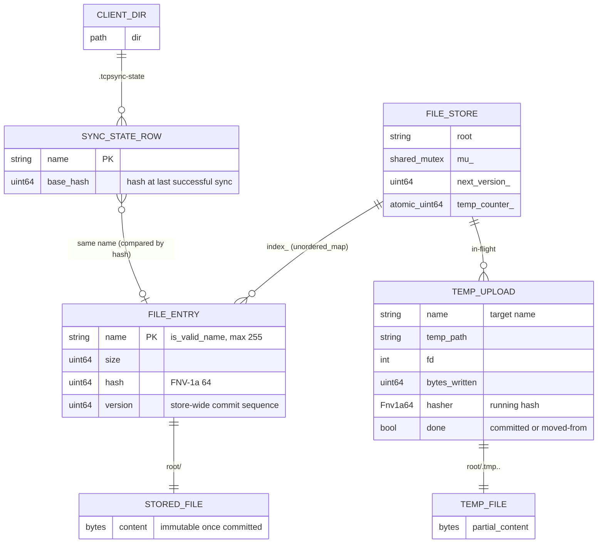

# Data model

## Is a database required? No.

The service stores **files**, and the metadata per file is tiny: a size, a hash and a version. The filesystem is already the database here:

- `rename()` gives atomic replacement, which is the "transaction" we need.
- A directory listing plus hashing rebuilds the index at startup in O(total bytes), so the index never has to be persisted separately. That means it can't drift from what's on disk.
- An in-memory `std::unordered_map` answers every lookup in O(1) under a `std::shared_mutex`.

Adding SQLite would buy multi-field queries, history and faster restarts for very large stores, at the cost of a dependency and a second source of truth to keep consistent with the files. That's worth it only if you add version history, users/ACLs or directory trees.

## Logical model



## Physical layout

```
server: <root>/
├── notes.txt                 committed file (immutable; replaced only via rename)
├── report.pdf
└── .tmp.41822.17             upload in progress (deleted on abort and at startup)

client: <sync dir>/
├── notes.txt
├── notes.txt.conflict        local copy set aside in a conflict (never synced)
├── .tcpsync-state            "<hash16> <name>" per line, rewritten atomically
└── .tcpsync-part-notes.txt   download in progress (renamed into place when verified)
```

## In-memory structures (STL choices)

| Structure | Type | Why |
|---|---|---|
| File index | `std::unordered_map<std::string, FileMeta>` | O(1) lookup by name; `LIST` copies it and sorts outside the lock |
| Active connections | `std::unordered_set<int>` | O(1) insert/erase of fds; iterated only on shutdown |
| Work queue | `std::queue<std::function<void()>>` | FIFO fairness between accepted connections |
| Workers | `std::vector<std::thread>` | Fixed size, joined on shutdown |
| Sync maps (client) | `std::map<std::string, uint64_t>` | Ordered, so sync output and the state file are deterministic |
