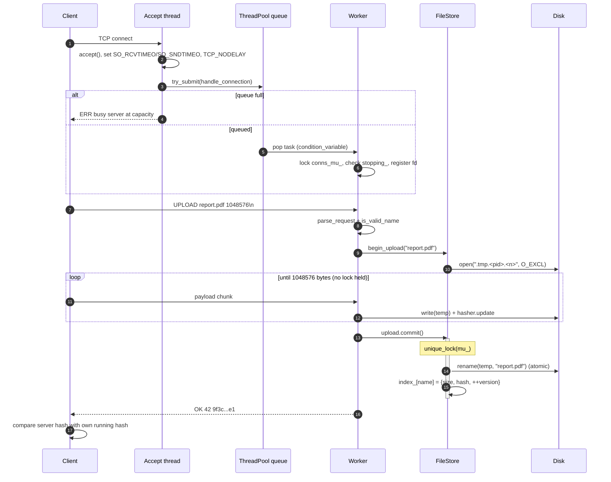
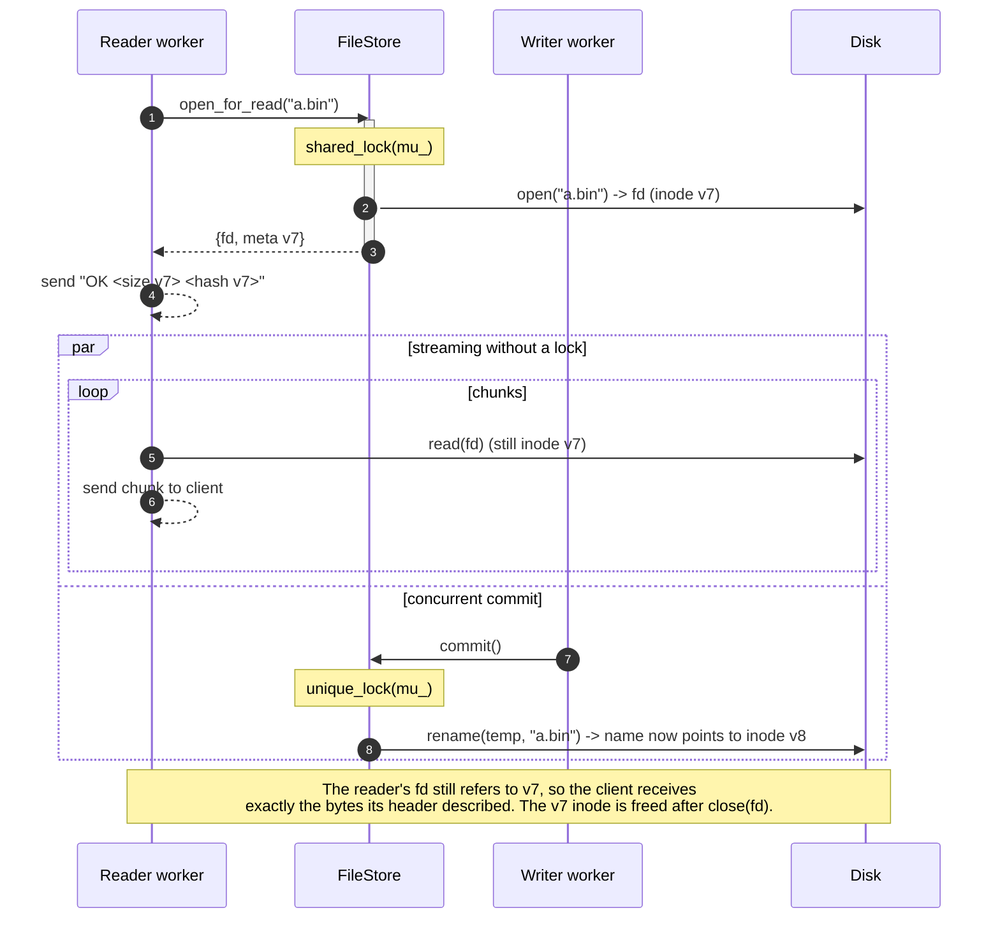
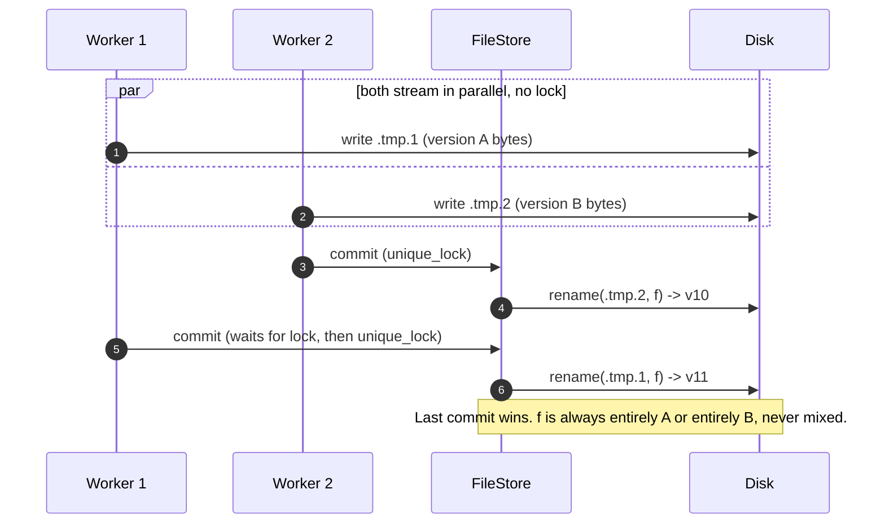
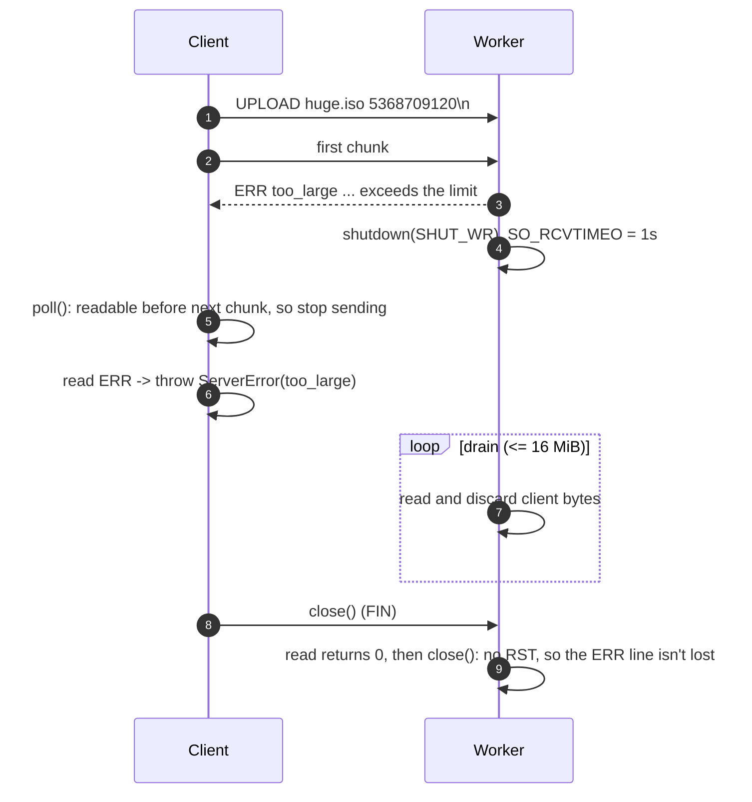
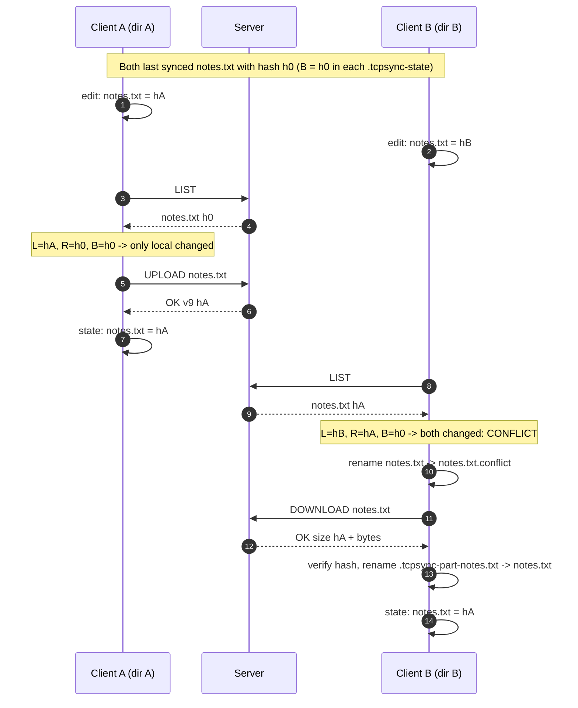
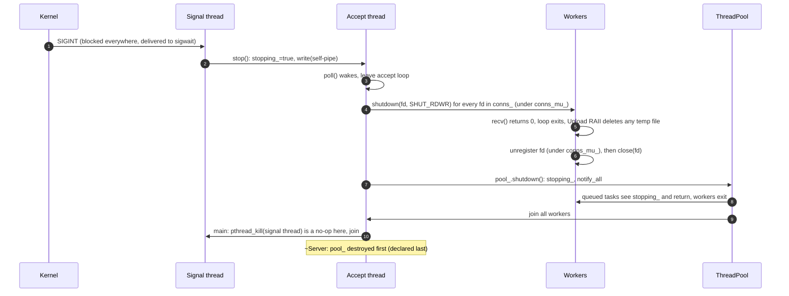

# Sequence diagrams

## 1. Connection setup and UPLOAD

## 2. DOWNLOAD: snapshot read while a writer commits

## 3. Same-name upload race

## 4. Rejected upload (too_large) with lingering close

## 5. Two-way sync with a conflict

## 6. Graceful shutdown

