# Work breakdown structure

```mermaid
flowchart TD
    P[tcp-sync] --> A[1 Foundations]
    P --> B[2 Networking]
    P --> C[3 Concurrency]
    P --> D[4 Storage]
    P --> E[5 Server]
    P --> F[6 Client & Sync]
    P --> G[7 Quality]
    P --> H[8 Docs]

    A --> A1[1.1 Makefile + CMake + Docker]
    A --> A2[1.2 Protocol spec]
    A --> A3[1.3 Thread-safe logger]

    B --> B1[2.1 UniqueFd RAII]
    B --> B2[2.2 listen/connect via getaddrinfo]
    B --> B3[2.3 send_all + buffered Reader]
    B --> B4[2.4 Timeouts, TCP_NODELAY, SIGPIPE]

    C --> C1[3.1 ThreadPool + bounded queue]
    C --> C2[3.2 Backpressure: ERR busy]
    C --> C3[3.3 Exception containment]

    D --> D1[4.1 Index + shared_mutex]
    D --> D2[4.2 Temp file + atomic rename commit]
    D --> D3[4.3 Snapshot reads via open fd]
    D --> D4[4.4 Startup rebuild + temp cleanup]

    E --> E1[5.1 poll accept loop + self-pipe]
    E --> E2[5.2 Request dispatch]
    E --> E3[5.3 Lingering-close rejections]
    E --> E4[5.4 sigwait graceful shutdown]

    F --> F1[6.1 Client API + verified transfers]
    F --> F2[6.2 CLI]
    F --> F3[6.3 3-way sync + conflicts + deletes]

    G --> G1[7.1 Unit + in-process E2E tests]
    G --> G2[7.2 Multi-process integration script]
    G --> G3[7.3 ASan / TSan / Valgrind]
    G --> G4[7.4 GDB/LLDB debugging drills]

    H --> H1[8.1 Architecture + data model]
    H --> H2[8.2 Sequence diagrams]
    H --> H3[8.3 C++ vs Python cheatsheet]
```

## Work packages

| ID | Package | Deliverable | Depends on | Done when | Est. |
|---|---|---|---|---|---|
| 1.1 | Build system | `Makefile`, `CMakeLists.txt`, `Dockerfile` | — | `make` builds 3 binaries without warnings | 0.5d |
| 1.2 | Protocol spec | `protocol.hpp` header comment, `docs/ARCHITECTURE.md` table | — | Every command/response/error defined | 0.5d |
| 1.3 | Logger | `log.hpp` | — | Lines from many threads don't interleave | 0.25d |
| 2.1–2.4 | Networking layer | `net.hpp/.cpp` | 1.1 | Partial send/recv, EINTR, timeouts handled | 1.5d |
| 3.1–3.3 | Thread pool | `thread_pool.hpp` | 1.3 | Tests: runs all tasks, rejects when full, survives throws | 1d |
| 4.1–4.4 | File store | `file_store.hpp/.cpp` | 1.2 | Concurrent writer/reader test: consistent snapshots, no temp leaks | 1.5d |
| 5.1–5.4 | Server | `server.hpp/.cpp`, `server_main.cpp` | 2, 3, 4 | E2E tests: concurrent round trip, busy, too_large, traversal, stop | 2d |
| 6.1–6.2 | Client + CLI | `client.hpp/.cpp`, `client_main.cpp` | 2 | Hash-verified upload/download from the CLI | 1d |
| 6.3 | Sync | `sync_directory` | 6.1 | Sync test: propagate, conflict, delete, steady state | 1d |
| 7.1–7.2 | Tests | `tests/unit_tests.cpp`, `tests/integration_test.sh` | 5, 6 | `make test` green | 1.5d |
| 7.3 | Dynamic analysis | `make asan tsan valgrind`, `make docker-check` | 7.1 | No race/leak/UB reports | 0.5d |
| 7.4 | Debugging drills | `docs/DEBUGGING.md` | 5 | Each drill reproduces and explains a real bug | 0.5d |
| 8.x | Docs | `docs/*.md`, `README.md` | all | Diagrams match the code | 1d |

**Critical path:** 1.1 → 2 → 4 → 5 → 7.1 → 7.3 (about 8 days of the total of about 13).

## Milestones

| Milestone | Contents | Exit criterion |
|---|---|---|
| M1 Single-client transfer | 1.x, 2.x, basic server loop | `nc` can LIST; one client uploads and downloads |
| M2 Concurrent & safe | 3.x, 4.x, 5.x | 16 concurrent clients + same-file race tests pass |
| M3 Sync | 6.x | Two directories converge, including conflicts and deletes |
| M4 Hardened | 7.x | Sanitizers and Valgrind clean; graceful SIGINT |
| M5 Documented | 8.x | Architecture, sequences and cheatsheet reviewed |
